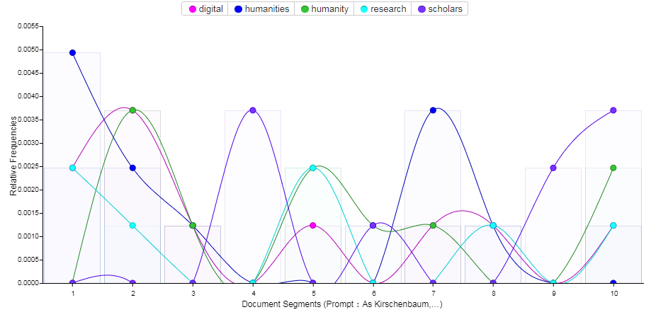

# Blog post

## Prompt:As Kirschenbaum, Alvarado, and Ramsay have variously argued, the digital humanities draws from a number of established disciplines and research methods. This is a terrible idea. Digital humanities research attempts to combine two things that are fundamentally incompatible: the sciences and the humanities. Empirical or scientific approaches believe in objective facts that stand on their own; humanities approaches believe that all truth exists from a subjective, human perspective. These two approaches are fundamentally at odds with each other, and they can never be combined. Give it up, dh!

As an emerging subject, digital humanity is bound to be controversial. Like Kirschenbaum, Alvarado, and Ramsay have variously argued that the sciences and the humanities are fundamentally at odds with each other and that is the reason why digital humanities research is fundamentally incompatible. However, I don't think that science and humanity are inseparable. Digital humanity is the proof of their integration, and its emergence is precisely the need of modern technology and academics.

First, digital humanity can use computer computing to achieve a theoretical thinking and practical application in academics. Linear and non-linear thinking patterns are generated by using computers to parse texts, subverting traditional analytical patterns. For example, in ‘Renaissance Literary Studies and Humanities Computing: Introduction’ Hilary J. Binda analyses the trope of hyper-textuality as it is figured in several contemporary theories of the new electronic technologies and, in doing so, challenges a radical distinction between print and hypertext and between the "logics" of linearity and nonlinearity with which each respectively is associated. she demonstrates that the simultaneity of linearity and nonlinearity, endlessness and boundedness, that inheres in textuality whether it be electronic or not. Prior to this, all scholars only used computer-aided retrieval of texts, and they did not correlate these resources. This discovery undoubtedly greatly enhances the efficiency of scholars' text collation and analysis, and because of the linear and nonlinear analysis and calculation, it is easier for scholars to obtain the relevance, timeliness and other information of the text to other texts in the same period. At the same time, this discovery proves that the combination of science and humanity can greatly reduce the length of academic research and extend the way of thinking.

Second, digital humanity enables complete cross-disciplinary research. In addition to the analysis of the text, it can also do a variety of analysis of pictures, tables, etc., and even be able to visualize data and deliver information in a more intuitive way. For instance, Neatline is a visual tool for synthesizing documents, graphic annotations and complex maps in timeline and narrative order. It not only parses text, but also analyzes data in combination with historical timelines and coordinates, and accurately presents the materials that scholars need through map annotations and storytelling. In addition to accurate scientific data, its timetable also respects the ambiguity, uncertainty and subjectivity of humanity and reflects the most humanistic value of scholarship. From ‘Neatline & Visualization as Interpretation’ says ‘Neatline sees humanities visualization not as a result but as a process: as an interpretive act that will itself – inevitably – be changed by its own particular and unique course of creation.’ to further confirm the feasibility of the combination of humanities and science, so that academic results have both scientific data and subjective analysis of humanities.

Third, the core of digital humanity is to emphasize what the human brain and computer are, what is smarter and more effective. Of course, not all computers are the smartest in all situations, and sometimes the human brain can handle problems better. Therefore, when it is suitable to use a computer, digital humanities researchers will make use of it; the part of the human brain that is more capable of exerting its advantages will be treated by the scholar's own academic quality. From a research paradigm perspective, this is also a combination of the "distant reading" strategy of the big data era and the "close reading" approach of the traditional print media era: computers and computational methods can help scholars to be complex, Quickly sorting out, locating, and grasping issues in a large amount of information, macroscopically “seeing” the focus of a discipline or even multiple disciplines such as linear and non-linear thinking patterns; at the same time, it requires scholars to play the role of personal ability and microscopically “explore” the intersection of complex information like Neatline software.

In conclusion, the conclusions of Kirschenbaum, Alvarado, and Ramsay are not suitable for today's academic era, because the digital humanity tool has become the 'best assistant' of contemporary scholars, its efficiency, powerful text analysis, charting capabilities and Interdisciplinary research capabilities have become a representative force. Scientifically, it can take both academic and humanistic scholars with more academic choices. In terms of humanity, scholars need to use their own subjective choices to filter and analyze the data through tools and explore.

# cite
Renaissance Literary Studies and Humanities Computing: Introduction. (2000). Early Modern LiteraryStudies,(3).https://proxy.library.brocku.ca/login?url=http://search.ebscohost.com/login.aspx?direct=true&db=edsglr&AN=edsgcl.121226900&site=eds-live&scope=site

http://nowviskie.org/2014/neatline-and-visualization-as-interpretation/
