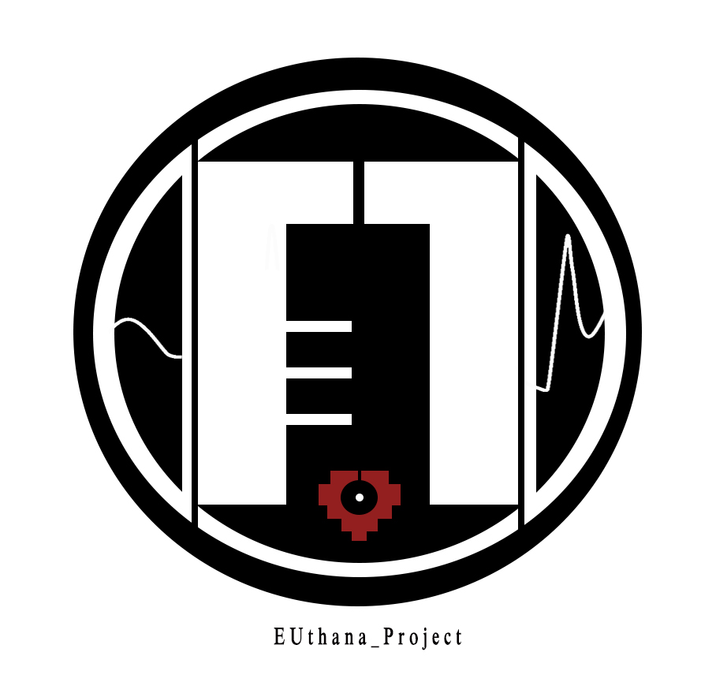
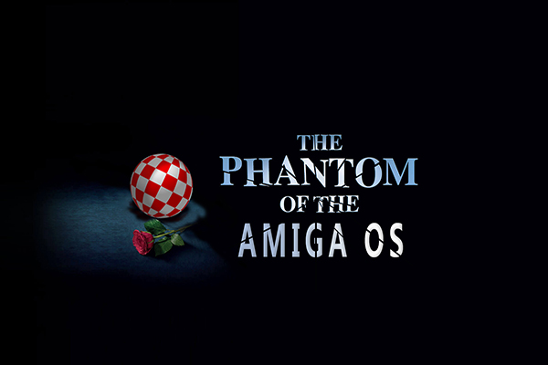

# IASC-2P02 | Danby Liu 

# About me & Bio

Hello,this is Danby,I am a third year student in the IASC program at Brock University.My specific research interest is media archaeology, and It means studying the process of the historical development and evolution of a media, and how it affects today’s media. This research also reflected in my projects in this portfolio, such as my featured project. In that project, I made a reserch slides which showed a history progress of an old Operating System. This project focuses on the history of the old operating system and the implications and changes for today's operating systems.Although very brief, I think the content is in full compliance with the content of media archaeology. In the future, I hope to continue to use this project as a game element in my  personal indie game works.I think everyone needs a channel or an opportunity to understand the history and meaning of one of our media, so I want to integrate it with the game elements, so that the game can have the concept of media archaeology. And the game is one of the most exciting channels for people to interest. If the game can be released in the future and resonate with the player, then my goal is achieved.

# Featured Project : The Phantom of the Amiga

# IASC-2P02-TeamPresentations
Shared repository for IASC 2P02 team 3 presentations.

 project

palladio by Stanford

 project URL

[Palladio](https://hdlab.stanford.edu/palladio/)

 Notes
slides/Notes go here.
[our slides](https://docs.google.com/presentation/d/1yaZbkcikFoIxXl-E5EmHkoj-OGK1jH4FrHXMuCH7YCM/edit#slide=id.g4b1aa37cf4_1_15)

[our image using](https://github.com/IascAtBrock/IASC-2P02-TeamPresentations/tree/Team3/research%20finding/image)

# Blog post assignment

[click me to view the blog post](https://euthana.github.io/IASC-2P02/BlogPost)

# Solo presentation page

[click me to view the solo-presentation](https://euthana.github.io/IASC-2P02/reveal/reveal/index.html)
